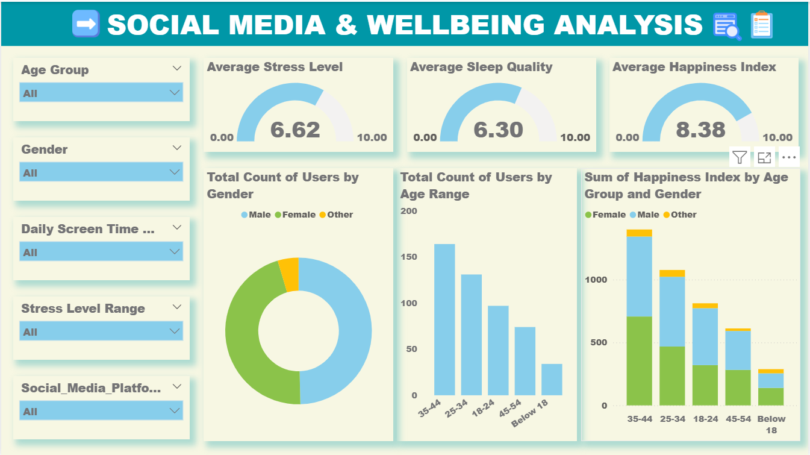
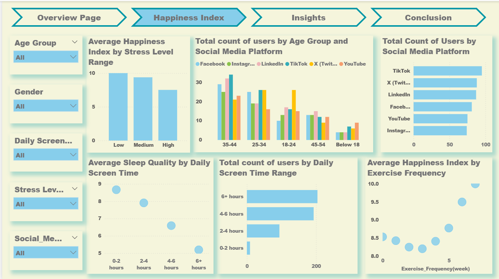

# 🛍️ Social Media and Wellbeing Analysis

## 📌 Project Overview

This project utilizes Power BI to analyze the relationship between social media usage, demographics, and various wellbeing indicators such as happiness, sleep quality, and stress levels. The goal is to identify patterns and provide actionable insights for improving digital wellness. 

---

## 📊 Dashboard Preview

- Overview Page: Displays high-level metrics including Average Happiness Index (8.38), Average Sleep Quality (6.30), and Average Stress Level (6.62).
- Happiness Index Insights: Deep dives into how stress and exercise frequency impact overall happiness scores across different age groups.
- Platform Usage: Analyzes user distribution across major platforms like TikTok, X (Twitter), and LinkedIn.
- Conclusion & Recommendations: Summarizes findings and suggests actions like encouraging digital breaks and promoting stress-relief content.

---

## 🛠️ Tools & Technologies

- Power BI Desktop
- DAX (Data Analysis Expressions)
- Power Query

---

## 📈 Key Insights

- Screen Time vs. Wellbeing: There is a strong correlation between high screen time (6+ hours) and reduced sleep quality and happiness. Conversely, those with 0–2 hours of daily screen time reported the highest sleep quality. 
- Stress Levels: The average stress level is relatively high at 6.62/10, indicating frequent mental strain among the surveyed users. 
- The Power of Exercise: Regular physical activity (6+ times/week) steadily improves happiness, even for heavy social media users.
- Demographics: The primary user base falls within the 25–44 age range, with females forming the largest share of respondents.
---

## 💡 Recommendations

- Digital Wellness: Encourage screen breaks to mitigate the negative impact on sleep.
- Mental Health Support: Promote stress-relief features and content to address high stress levels. 
- Physical Activity: Introduce reminders for physical activity to boost user happiness. 

---

## 👨‍💻 Author

Sithara Parvin |   
Aspiring Data Analyst | Python | EDA | Business Analytics
